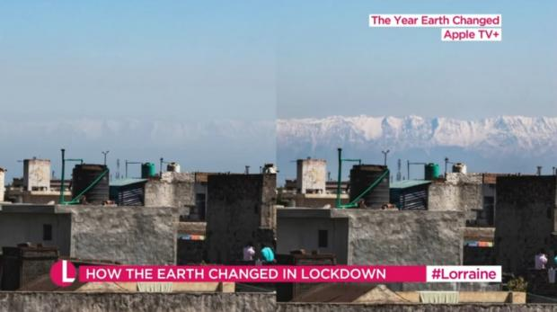
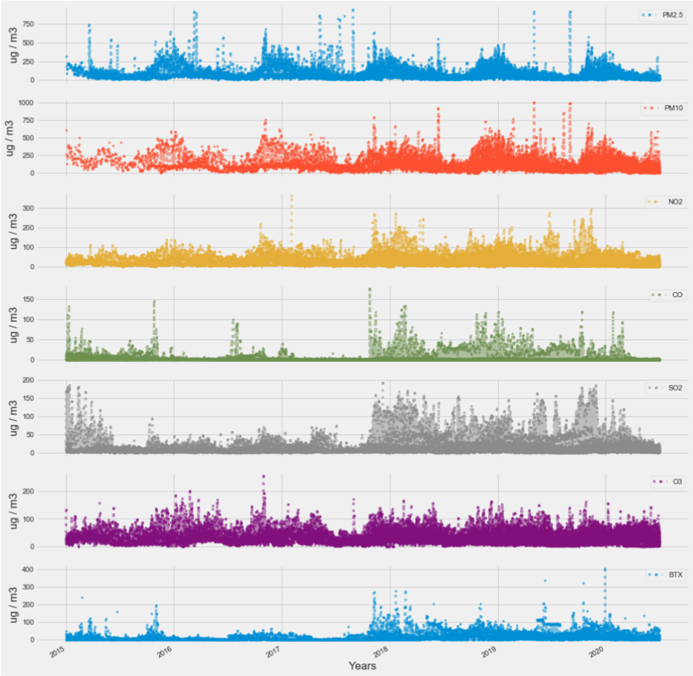
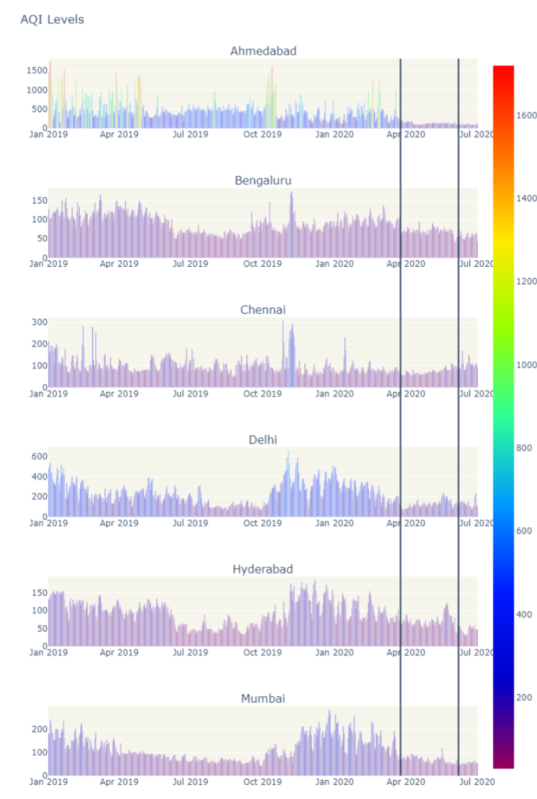
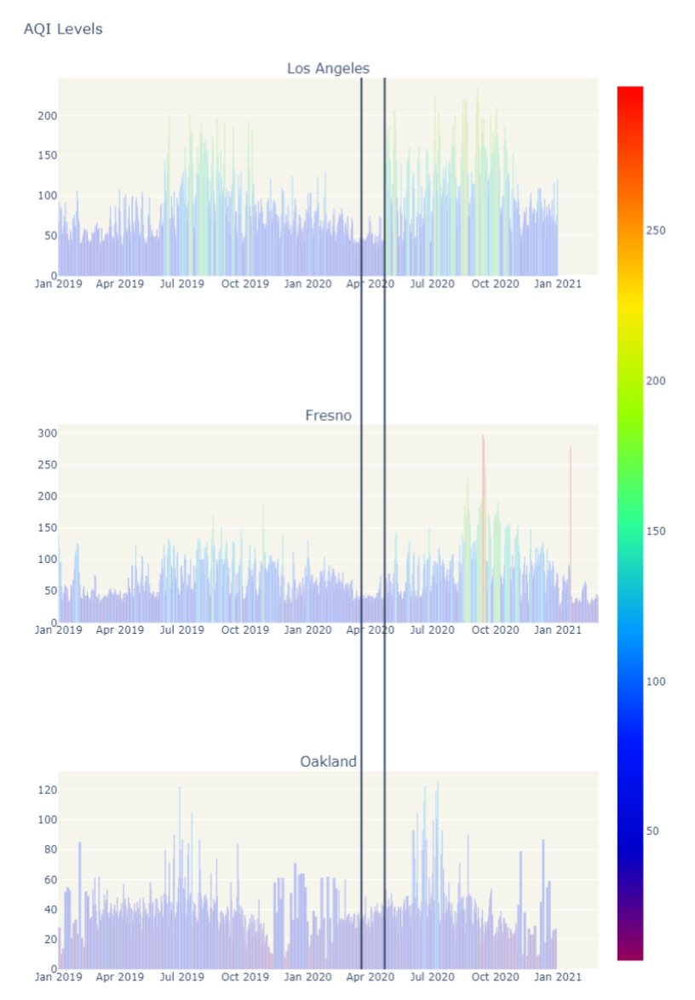
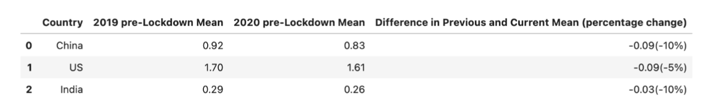
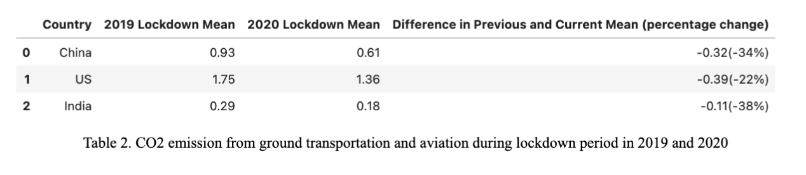
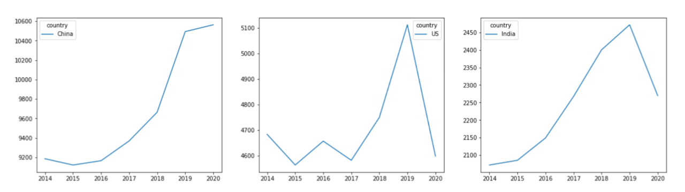

# The Year Earth Changeds
COVID-19 pandemic has substantially affected human society, including health care, economic structures, and social relationships.  It is the first time in history that people all over the world were required to stay at home. Released on the Earth day 2021, the documentary **The Year Earth Changed** [1] revealed that the pandemic improved the global air quality and reduces greenhouse gas emissions. For instance, in Jalandhar, India, 2020 is the first time people were able to see the Himalays, the mountain ranges hidden behind the polluted airs for 30 years. [2]

<figure>

<figcaption align = "center"><b>Fig.1 The Himalayas before and after lockdown in Jalandhar, India(</b></figcaption>
</figure>

Inspired by the documentary, we studied whether the claims are backed by data. Our study has two parts: firstly we analyzed air quality in India and California, secondly we studied CO2 emissions in China, United States and India. In evaluations, we found drops of both the air pollution and CO2 emission during the COVID lockdown. We believe that understanding how our environment was affected by COVID-19 provides important insights on healthcare and pollution control.

## Air Quality Analysis
We obtained daily air data for each city in India from 2015 to 2022，including PM2.5, PM10, NO, NO2 and etc. Based on these data, we analyzed the air quality of each city in India before and after the regional lockdown period, 2020.03.25 - 2020.06.06 and studied how the regional lockdown policy impacted the air quality in India.

Among all the Indian cities in the dataset, we focused on a few cities with poorer air quality than the others. They are Ahmedabad, Bengaluru, Chennai, Delhi, Hyderabad and Mumbai.
We also listed the data of all types of pollution to test the stableness of data distribution. Shown in the following graph, we observed seasonal effects on  PM 2.5 and PM 10. The pollution level is higher in winter than summer. This pattern has continued to this day, so we can assume that it may not change during the lockdown period. 

<figure>

<figcaption align = "center"><b>Fig.2 india data distribution</b></figcaption>
</figure>

Once we had the preliminary preparations, we used the time of lockdown as the standard to study the changes in air quality. With plotting the AQI value during the 2020, we can compare the AQI level before and after the lockdown policy. To study the overall impact of lockdown policy on air quality, we also acquired the air quality data in California.

The average AQI of California is about 95% better than India, so our study can reflect that the COVID-19 lockdown not only affected the air quality in areas with relatively polluted air, but also in areas with good air quality.
In figure below, two black vertical lines in the left and right image were used to denote the first phase of lockdown in India and California and the variation of various pollutant levels are from Jan 2019 to Jul 2020. Compared with the AQI value of California, all the above Indian cities have a dangerously high level of pollution. After Mar 25 2020, we observed a clear decline of AQI value in all the cities under lockdown. 

<figure>

<figcaption align = "center"><b>Fig.3 AQI values from 2019-2020 in India</b></figcaption>
</figure>

<figure>

<figcaption align = "center"><b>Fig.4 AQI values from 2019-2021 in California</b></figcaption>
</figure>

As AQI levels have a significant drop after the lockdown policy was posted, we concluded that the lockdown policy has a very positive impact on air pollution in both India and California. 

## Carbon Dioxide Emission Analysis

To analyze global emission of Co2, we acquired emission data from Carbon Monitor[3], a website that provides daily Co2 regularly. In our study, we chose China, U.S and India as representative countries, as they produce the most CO2 across the world. Our dataset contains the emissions from Jan 1 2019 to Dec 30 2020. The emissions are measured from a diverse range of activities, e.g. electrical power generation, industrial production, ground transportation, residential activity, and domestic and international aviation. As people were required to stay at home and travel was limited, here we focused our analysis on ground transportation and aviations.  				
			
First, we analyzed the emission change in each country’s lockdown period. India has a national lockdown policy, while China and the U.S does not, so we chose the lockdown periods in New York, U.S and Wuhan, China as representative areas. 

Then, we calculated statistics for the emissions before and during the lockdown period in 2019 and 2020 and reported both absolute differences and percentage change. Figure below illustrates the co2 emissions before the lockdown period in the two years.  Compared to 2019, the average emission in 2020 reduced 10% in China, 10% in India, and 5% in the U.S. 

<figure>

<figcaption align = "center"><b>Fig.5 CO2 emissions from ground transportation and aviations during pre-lockdown period in 2019 and 2020</b></figcaption>
</figure>

However, as shown in figure 6, during the lockdown period,  more significant reductions were observed. The average co2  is reduced 34% in China, 38% in India, and 22% in the U.S. 

<figure>

<figcaption align = "center"><b>Fig.6 CO2 emissions from ground transportation and aviations during lockdown period in 2019 and 2020</b></figcaption>
</figure>

To analyze the long term impact of lockdown on Co2 emission, we also studied the trend of yearly emissions from 2014 to 2020. We acquired the historical yearly emission data through Climate Watch[4] from 2014 to 2018 and computed the sum of daily emissions in 2019 and 2020. Figure 7 shows the trend in those countries. We observed that China still increased the emission in 2020 but the growth is much slower than the previous years. And both India and U.S have a significant drop in 2020.

<figure>

<figcaption align = "center"><b>Fig.7 Yearly CO2 emissions from 2014-2020 in China, U.S and India </b></figcaption>
</figure>

## Conclusion
Our findings proves that, during the COVID-19 lockdown, air pollution has declined across India and California and CO2 has declined in U.S, and India. The emission in China still increased, but the growth was much slower than the previous years. The improvement of pollution are likely associated with reduced ground transportation and aviation.
Our research provides real-time measurements, which is the ground based quantification of pollution change. 

Air pollution and CO2 emission have important health implications. Our analysis emphasizes the importance of continued enforcement of air quality and greenhouse gas emission to protect the public health and the planet earth. 
In future work, we should study the causation of COVID-19 lockdown and environmental changes. We should also investigate the impact of weather and large-scale events on environmental changes to improve the accuracy of our analysis.

